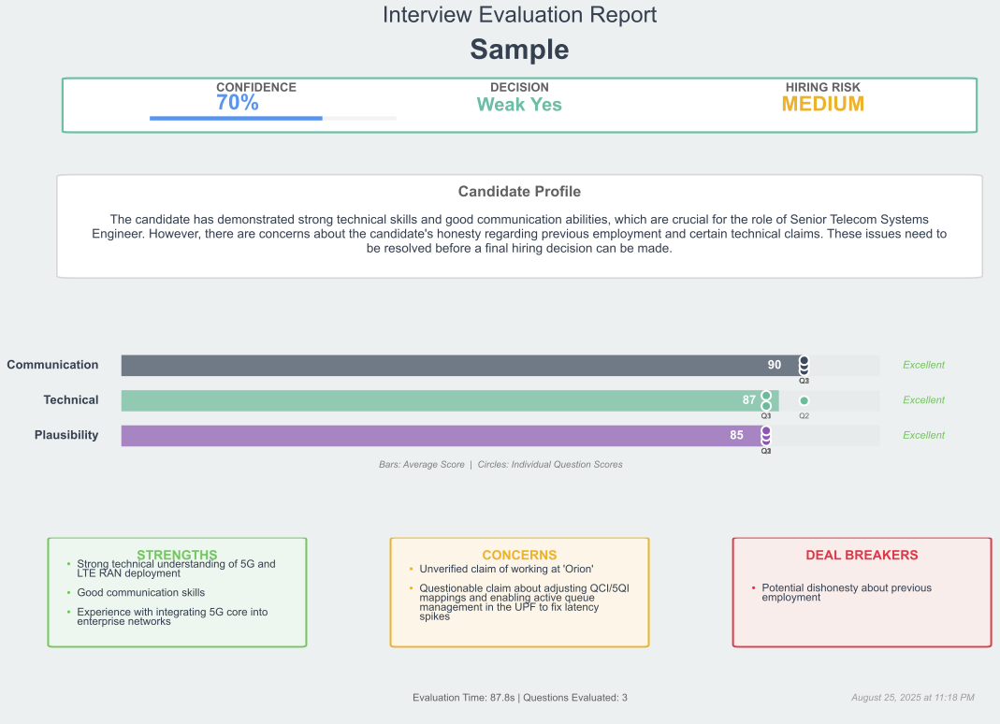

# Interview Eval

AI-powered interview evaluation with LangChain, LangGraph, and GPT-4 for fact-checking, hallucination detection, structured scoring, and one-slide executive summaries.

---

## Example Output

Below are two sample one-slide evaluations generated by the system.

### Example 1: Weak Yes


---

### Example 2: Strong No


---

## Capabilities & Quality Coverage

| Dimension               | How It’s Addressed in This System                                                                                                            |
|-------------------------|----------------------------------------------------------------------------------------------------------------------------------------------|
| **GenTech Fluency**     | Uses LangChain + LangGraph for orchestration, custom tools for web verification, structured Pydantic outputs, prompt-driven flows            |
| **Rigor of Evaluation** | 3-axis scoring, claim extraction, targeted verification, evidence scoring, and red-flag detection                                            |
| **Modularity & Reuse**  | Clear abstractions (`BaseEvaluator`, `CandidateEvaluator`, `WebSearchTool`, Pydantic schemas). Works with any job description + question set |
| **Visualization**       | Auto-generated single-page PDF with decision, scores, strengths, concerns, and deal-breakers                                                 |
| **Creativity**          | Namespace-isolated caching, batch mode, parallelism, JSON artifacts                                                                          |

---

## Highlights

- **Batch processing** for multiple candidates with comparison visualizations.
- **Parallel evaluators** for Plausibility, Technical, and Communication (0–100).
- **Entity extraction & web verification** with a 1000+ tech knowledge base.
- **SQLite-backed cache** with namespace isolation per transcript.
- **One-page PDF** per candidate: scores, rationale, strengths/concerns/deal-breakers.
- **Prometheus metrics** for monitoring evaluation performance.
- **Pre-commit hooks** for code quality and formatting consistency.

---

## Architecture

```mermaid
flowchart TD
    A[Transcript] --> B[Orchestrator]
    B --> C[Entity Extractor]
    C --> D[Web Verifier]
    B --> E[Plausibility Evaluator]
    B --> F[Technical Evaluator]
    B --> G[Communication Evaluator]
    E --> H[Synthesis]
    F --> H
    G --> H
    H --> I[PDF Generator]
    D -.-> J[(Cache)]
    E -.-> J
    F -.-> J
    G -.-> J
 ```

- **LangChain** orchestrates async chains.
- **OpenAI (GPT-4)** drives scoring, synthesis, and extraction.
- **DuckDuckGo Search** verifies entities/claims in real time (cached).
- **SQLite + in-memory LRU** provides persistent caching and metrics.
- **CI/CD:** GitHub Actions runs pytests on each push/PR; pre-commit hooks enforce formatting, linting, import order, 
and clean notebooks before commit.

---

## What Problems This Solves

**Grounding & Retrieval**  
Extracts companies/technologies/claims and validates via search & local knowlesge base. Per-transcript cache namespaces prevent cross-candidate contamination.

**Verification & Hallucination Detection**  
1) Known technology database check (instant)  
2) Web search for unknowns (cached)  
3) LLM plausibility in context  
4) Cross-question consistency  
→ Flags impossible claims, missing specifics, contradictions.

**Scale Across Candidates/Jobs**  
Modular evaluators; YAML prompts (no code edits). Configurable parallelism and batch runs. Fresh evaluator instances per transcript for isolation.

---

## Evaluation Dimensions

- **Plausibility** — Truthfulness & feasibility  
- **Technical** — Accuracy & depth  
- **Communication** — Clarity & professionalism  

**Synthesis** produces: Recommendation (Strong/Weak Yes/No), Confidence, Risk (Low/Medium/High), Deal-breakers, and detailed rationale.

---

## Quick Start
### Basic Setup
```bash
# Install
pip install -e .

# Configure (set your API key)
echo "OPENAI_API_KEY=sk-..." > .env

# Run
python src/run_evaluation.py
```

### Development Setup
```bash
# Install with dev dependencies
pip install -e ".[dev]"

# Setup pre-commit hooks
pre-commit install

# Run tests
pytest
```

---

## Inputs

Place files in `data/`:
- `job_description.txt` — Role requirements
- `questions.txt` — Questions separated by **double newlines**
- `transcripts/*.txt` — Q&A style transcripts (supports `Q1:/A1:` or raw text)

---

## Outputs

- **Per-candidate JSON** + **PDF** visualization:
  - Horizontal bar chart with per-question markers
  - Color-coded decision & risk
  - Strengths / Concerns / Deal-breakers
  - Centered Candidate Profile rationale
- Optional comparison PDF when evaluating multiple candidates.

---

## CLI & Config

```bash
# Common options
python src/run_eval.py \
  --model gpt-4 \
  --parallel 5 \
  --no-cache \
  --clean-cache \
  --export-cache \
  --no-visualization
```

**Key environment settings** (via `.env` or env vars):
- `OPENAI_API_KEY` (required)
- `OPENAI_MODEL` (default: `gpt-4`)
- `MAX_PARALLEL_EVALUATIONS` (default: `3`)

---

## Project Structure

```python
src/intervieweval/
├── evaluators/       # Plausibility, Technical, Communication, Synthesis
├── tools/            # Search, entity verification
├── cache/            # Persistent cache (SQLite + LRU)
├── models/           # Pydantic schemas
├── prompts/          # YAML templates
└── visualization/    # PDF generation
```

---

## Extending the System

```python
# Add a new evaluator (example)
from intervieweval.evaluators.base import BaseEvaluator

class MedicalEvaluator(BaseEvaluator):
    def get_prompt_key(self) -> str:
        return "medical_assessment"

# Swap models at runtime
from intervieweval.config.settings import Settings
settings = Settings(openai_model="gpt-4o-mini")

# Use custom prompts
from intervieweval.prompts.manager import PromptManager
prompt_manager = PromptManager("custom_prompts.yaml")
```